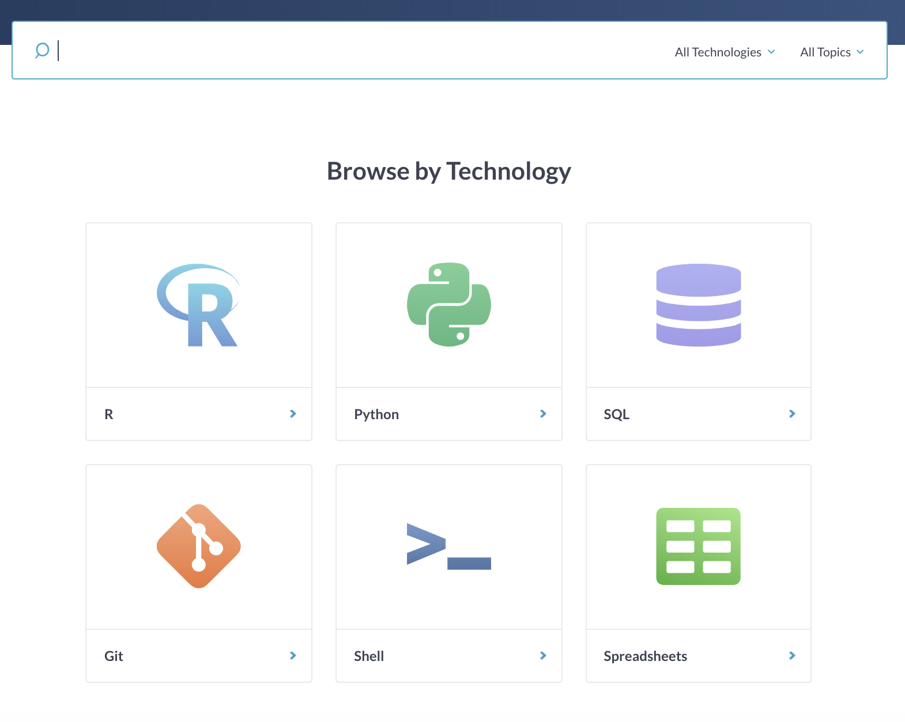
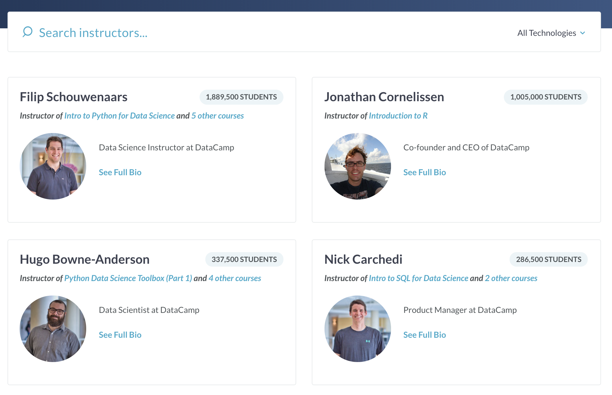

# 14D004 Scraping Project

## Project Description

The data and code in this repository allows users to scrape all the avalible courses on [datacamp.com](https://www.datacamp.com/courses) and scape all job posts on [jobsinbarcelona.es](http://jobsinbarcelona.es/) using [scrapy](https://scrapy.org/) an open source and collaborative framework for extracting the data you need from websites.

### **[Datacamp](https://www.datacamp.com/courses):** 
On the datacamp course page itself, you can search for courses of interest or browse by technology. 
<p align="center">
  
</p>

the `datacamp.py` script extracts all of the course titles within these six thechnologies, along with their course description, author, authors occupation and url. 

<p align="center">
  
</p>

### **[Jobs in barcelona](http://jobsinbarcelona.es/):** 
On the datacamp course page itself, you can search for courses of interest or browse by technology. 
<p align="center">
  
</p>

the `datacamp.py` script extracts all of the course titles within these six thechnologies, along with their course description, author, authors occupation and url.

<p align="center">
  
</p>

### **[Datacamp Instructors](https://www.datacamp.com/instructors):** 
On the datacamp course page itself, you can search for courses of interest or browse by technology. 
<p align="center">
  
</p>

the `datacamp.py` script extracts all of the course titles within these six thechnologies, along with their course description, author, authors occupation and url. 

<p align="center">
  
</p>


- Code was written Python 3.6 and Scrapy 1.5.1

## Folders 

- **datacamp**: Scrapy datacamp project stored here
- **jobsinbarcelona**: Scrapy jobsinbarcelona project stored here
- **datacamp_instructors**: Scrapy datacamp instructors project stored here

Each of which are a directory with the following contents (datacamp used for example):
```
datacamp/
    scrapy.cfg            # deploy configuration file
    datacamp.csv          # scaped data exported as .csv
    datacamp.json          # scaped data exported as .json

    datacamp/             # project's Python module, you'll import your code from here
        __init__.py

        items.py          # project items definition file (not used)

        middlewares.py    # project middlewares file (not used)

        pipelines.py      # project pipelines file (not used)

        settings.py       # project settings file (not used)

        spiders/          # a directory with the spiders
            __init__.py
            datacamp.py   # This is the code for our datacampe Spider
```

## Prerequisites
### Installing Scrapy

Install the latest version of Scrapy (I recommend using [Anaconda](https://www.anaconda.com/download/))

- Anaconda distribution
```bash
conda install scrapy
```
- PyPI
```bash
pip install scrapy
```

## How to run the Spiders

To put the spiders to work, go to the relevent project’s top level directory (i.e datacamp or jobsinbarcelona) and run:
```bash
scrapy crawl datacamp
```
or
```bash
scrapy crawl jobsinbarcelona
```
or
```bash
scrapy crawl datacamp_instructors
```

## Storing the scraped data

The simplest way to store the scraped data is by using Feed exports, with the following command:
```bash
scrapy crawl datacamp -o datacamp.csv
```
or
```bash
scrapy crawl jobsinbarcelona -o jobsinbarcelona.csv
```
or
```bash
scrapy crawl datacamp_instruct -o datacamp_instructors.csv
```

That will generate a datacamp.csv, jobsinbarcelona.csv and datacamp_instructors.csv file containing all the scraped items. 

You can also use other formats, like JSON:
```bash
scrapy crawl datacamp -o datacamp.json
```

Note: for historic reasons, Scrapy appends to a given file instead of overwriting its contents. If you run this command twice without removing the file before the second time, you’ll end up with a broken file. 
